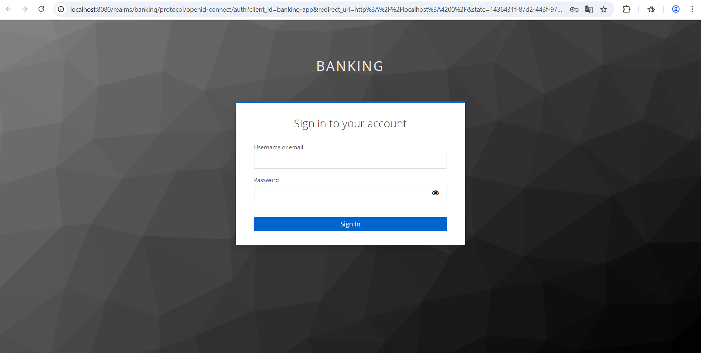
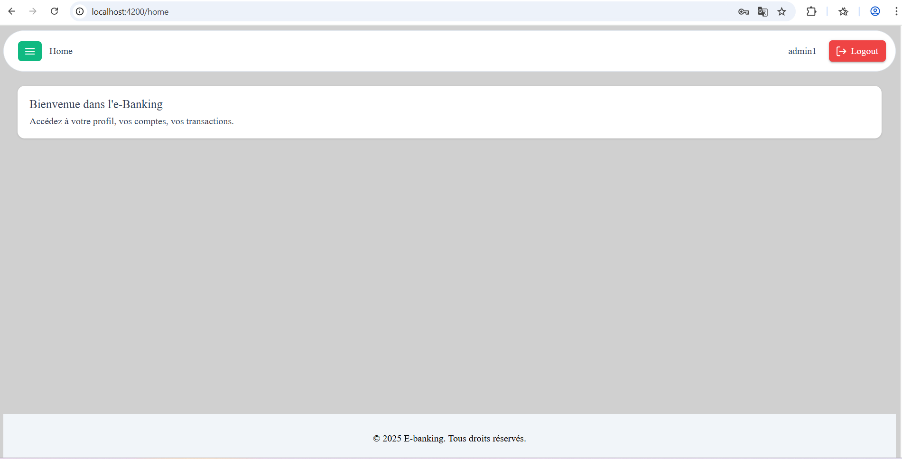
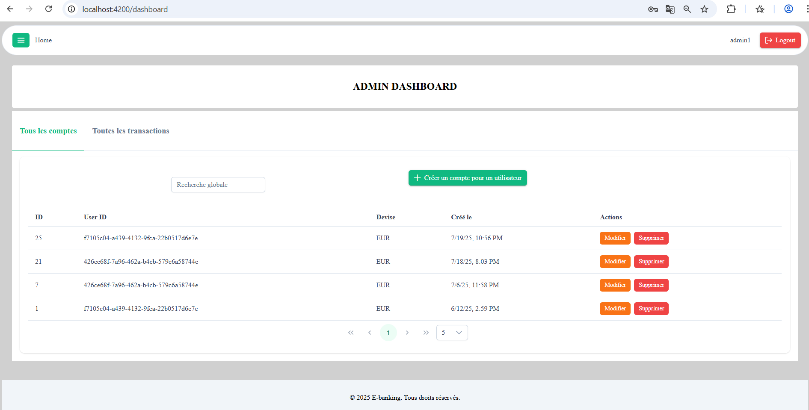
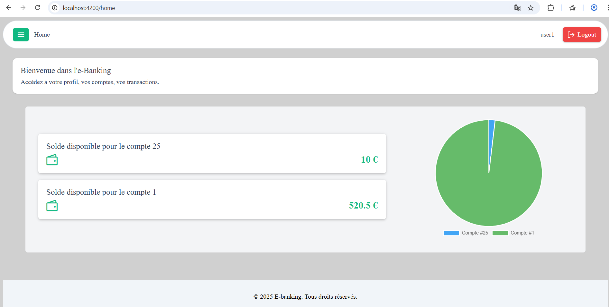
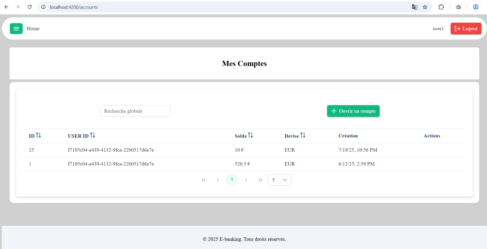
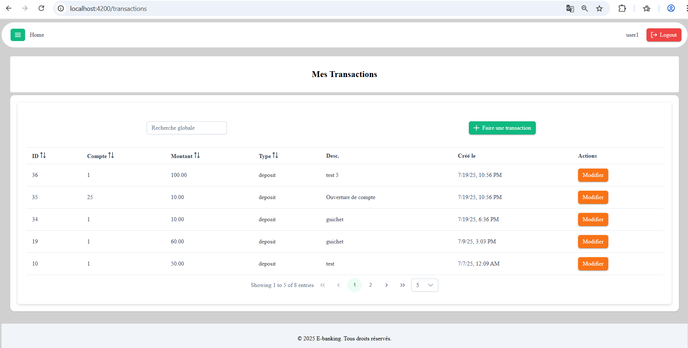

# e-Banking MVP

This repository contains a Minimal Viable Product (MVP) for a simple banking application with:

## Features

- **Authentication** : Login using JWT-based authentication with Keycloak.
- **View profile information**

**Accounts Management** : 

- **User** role: manage personal accounts and transactions
- **Admin** role: full CRUD on all accounts, transactions and user directory 

## Technologies Used

- **Backend**: Node.js, Express, PostgreSQL 
- **Frontend**: Angular 19, PrimeNG
- **Auth**: Keycloak 
- **Docs**: Swagger / OpenAPI 

---

## Application Preview

Here are some screenshots of the e-Banking MVP in action:

### Login with Keycloak


### Admin Home


### Admin Dashboard


### User Home


### Account Management


### Transaction Management


---

## Folder Structure

```txt
e-banking-mvp/
├── README.md
├── docker-compose.yml
├── package.json
├── backend/
│   ├── Dockerfile
│   ├── init.sql
│   ├── package-lock.json
│   ├── package.json
│   ├── server.js
│   ├── .env
│   ├── config/
│   │   ├── db.js
│   │   ├── keycloak.js
│   │   └── roles.js
│   ├── controllers/
│   │   ├── admin/
│   │   │   ├── accountsController.js
│   │   │   ├── transactionsController.js
│   │   │   └── usersController.js
│   │   └── user/
│   │       ├── accountsController.js
│   │       └── transactionsController.js
│   ├── docs/
│   │   └── openapi.yaml
│   ├── middlewares/
│   │   ├── checkOwnership.js
│   │   ├── checkTxOwnership.js
│   │   └── validation.js
│   ├── routes/
│   │   ├── admin.js
│   │   ├── admin/
│   │   │   ├── accounts.js
│   │   │   ├── index.js
│   │   │   ├── transactions.js
│   │   │   └── users.js
│   │   └── user/
│   │       ├── accounts.js
│   │       └── transactions.js
│   ├── services/
│   │   ├── accountService.js
│   │   ├── transactionService.js
│   │   └── admin/
│   │       ├── accountService.js
│   │       ├── keycloakService.js
│   │       └── transactionService.js
│   └── validators/
│       ├── accountValidators.js
│       ├── transactionValidators.js
│       └── admin/
│           ├── accountsValidator.js
│           └── transactionValidators.js
└── frontend/
    ├── angular.json
    ├── package-lock.json
    ├── package.json
    ├── tsconfig.app.json
    ├── tsconfig.json
    ├── tsconfig.spec.json
    ├── .editorconfig
    ├── .gitignore
    ├── public/
    └── src/
        ├── index.html
        ├── main.ts
        ├── styles.scss
        ├── app/
        │   ├── app.component.html
        │   ├── app.component.scss
        │   ├── app.component.spec.ts
        │   ├── app.component.ts
        │   ├── app.config.ts
        │   ├── app.routes.ts
        │   ├── core/
        │   │   ├── guards/
        │   │   │   ├── admin.guard.spec.ts
        │   │   │   ├── admin.guard.ts
        │   │   │   ├── logged.guard.spec.ts
        │   │   │   └── logged.guard.ts
        │   │   ├── interceptors/
        │   │   │   ├── auth.interceptor.spec.ts
        │   │   │   └── auth.interceptor.ts
        │   │   ├── keycloak/
        │   │   │   └── keycloak.config.ts
        │   │   ├── models/
        │   │   │   ├── account.ts
        │   │   │   ├── profile.ts
        │   │   │   └── transaction.ts
        │   │   └── services/
        │   │       ├── account.service.spec.ts
        │   │       ├── account.service.ts
        │   │       ├── admin.service.spec.ts
        │   │       ├── admin.service.ts
        │   │       ├── transaction.service.spec.ts
        │   │       └── transaction.service.ts
        │   ├── feature/
        │   │   └── pages/
        │   │       ├── account/
        │   │       │   ├── account.component.html
        │   │       │   ├── account.component.scss
        │   │       │   ├── account.component.spec.ts
        │   │       │   └── account.component.ts
        │   │       ├── dashboard/
        │   │       │   ├── dashboard.component.html
        │   │       │   ├── dashboard.component.scss
        │   │       │   ├── dashboard.component.spec.ts
        │   │       │   └── dashboard.component.ts
        │   │       ├── home/
        │   │       │   ├── home.component.html
        │   │       │   ├── home.component.scss
        │   │       │   ├── home.component.spec.ts
        │   │       │   └── home.component.ts
        │   │       ├── notautorized/
        │   │       │   ├── notautorized.component.html
        │   │       │   ├── notautorized.component.scss
        │   │       │   ├── notautorized.component.spec.ts
        │   │       │   └── notautorized.component.ts
        │   │       ├── pagenotfound/
        │   │       │   ├── pagenotfound.component.html
        │   │       │   ├── pagenotfound.component.scss
        │   │       │   ├── pagenotfound.component.spec.ts
        │   │       │   └── pagenotfound.component.ts
        │   │       ├── profile/
        │   │       │   ├── profile.component.html
        │   │       │   ├── profile.component.scss
        │   │       │   ├── profile.component.spec.ts
        │   │       │   └── profile.component.ts
        │   │       └── transaction/
        │   │           ├── transaction.component.html
        │   │           ├── transaction.component.scss
        │   │           ├── transaction.component.spec.ts
        │   │           └── transaction.component.ts
        │   └── shared/
        │       └── components/
        │           ├── admin/
        │           │   ├── account-table/
        │           │   │   ├── account-table.component.html
        │           │   │   ├── account-table.component.scss
        │           │   │   ├── account-table.component.spec.ts
        │           │   │   └── account-table.component.ts
        │           │   ├── accounts-tab/
        │           │   │   ├── accounts-tab.component.html
        │           │   │   ├── accounts-tab.component.scss
        │           │   │   ├── accounts-tab.component.spec.ts
        │           │   │   └── accounts-tab.component.ts
        │           │   ├── create-account-modal/
        │           │   │   ├── create-account-modal.component.html
        │           │   │   ├── create-account-modal.component.scss
        │           │   │   ├── create-account-modal.component.spec.ts
        │           │   │   └── create-account-modal.component.ts
        │           │   ├── create-transaction-modal/
        │           │   │   ├── create-transaction-modal.component.html
        │           │   │   ├── create-transaction-modal.component.scss
        │           │   │   ├── create-transaction-modal.component.spec.ts
        │           │   │   └── create-transaction-modal.component.ts
        │           │   ├── transaction-table/
        │           │   │   ├── transaction-table.component.html
        │           │   │   ├── transaction-table.component.scss
        │           │   │   ├── transaction-table.component.spec.ts
        │           │   │   └── transaction-table.component.ts
        │           │   └── transactions-tab/
        │           │       ├── transactions-tab.component.html
        │           │       ├── transactions-tab.component.scss
        │           │       ├── transactions-tab.component.spec.ts
        │           │       └── transactions-tab.component.ts
        │           ├── footer/
        │           │   ├── footer.component.html
        │           │   ├── footer.component.scss
        │           │   ├── footer.component.spec.ts
        │           │   └── footer.component.ts
        │           ├── menu/
        │           │   ├── menu.component.html
        │           │   ├── menu.component.scss
        │           │   ├── menu.component.spec.ts
        │           │   └── menu.component.ts
        │           └── monitor-account/
        │               ├── monitor-account.component.html
        │               ├── monitor-account.component.scss
        │               ├── monitor-account.component.spec.ts
        │               └── monitor-account.component.ts
        └── environments/
            ├── environment.development.ts
            └── environment.ts

```

---

## Setup Instructions

### Prerequisites

- Node.js ≥ 18
- npm ≥ 9
- Docker & Docker Compose (for Keycloak & Postgres)

### Clone & Install

```bash
git clone https://github.com/Sandirane/e-banking-mvp.git
cd e-banking-mvp/backend
npm install
cd ../frontend
npm install
```

### Environment Variables

Copy `.env.example` and fill in your values:

```
PORT=3000
DB_HOST=localhost
DB_PORT=5432
DB_USER=ebankuser
DB_PASSWORD=ebankpass
DB_NAME=ebankdb
KEYCLOAK_URL=http://localhost:8080
KEYCLOAK_REALM=master
KEYCLOAK_ADMIN_REALM=banking
KEYCLOAK_ADMIN_CLIENT=admin-cli
KEYCLOAK_ADMIN_USERNAME=admin
KEYCLOAK_ADMIN_PASSWORD=admin
```

### Run Locally

Start Keycloak & Postgres via Docker Compose:

````bash
docker-compose up --build
 
````

### Access URLs

- Keycloak : http://localhost:8080
- Frontend : http://localhost:4200  
- API backend : http://localhost:3000 

---

## API Documentation

Swagger docs are available at:

```
http://localhost:3000/api-docs
```

You can explore all endpoints, schemas, try requests.

---

## Frontend Usage

- Log in via Keycloak
- **User** sees `Accounts` and `Transactions` pages.
- **Admin** sees additional `Dashboard` for full CRUD and user list.

---
 
## Author 

Created by **Sandirane**  
[GitHub Profile](https://github.com/Sandirane)